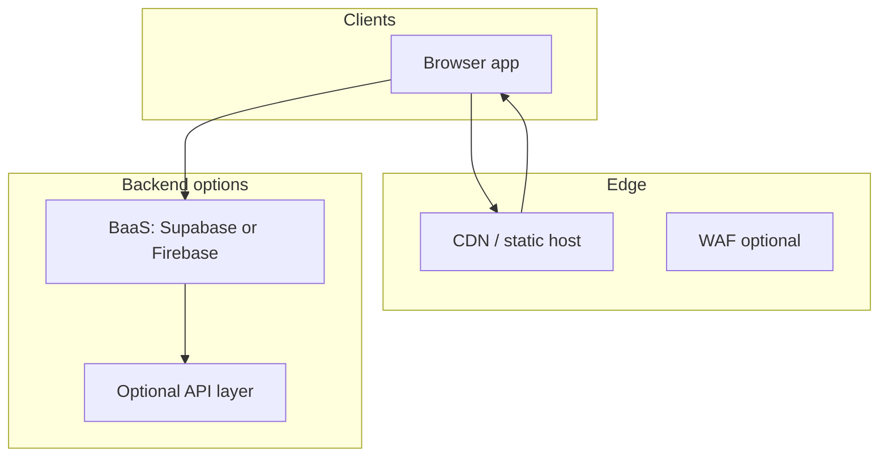

# Phase C — B2B-ready product (auth, multi-tenant, legal)

Phase C applies when a paying customer requires **shared team data**, **per-seat access**, and **auditability**—beyond device-local IndexedDB.

---

## Architecture (target)

| Layer | Responsibility |
|-------|------------------|
| **Static frontend** | CRM UI, playbook (could stay static build or add React later) |
| **Auth** | Email magic link, SSO (later), or OAuth—**Supabase Auth** / **Firebase Auth** |
| **Data** | `clients` (and future `organizations`, `users`) in **Postgres** (Supabase) or Firestore with **security rules** |
| **Multi-tenancy** | Every row scoped by `org_id` (or `tenant_id`); RLS policies **deny cross-tenant reads** |
| **Backups** | Managed by provider + periodic exports to object storage |

---

## Why Supabase is a strong fit (when you reach Phase C)

- **Postgres** matches relational CRM queries (filters, reporting).
- **Row Level Security** for tenant isolation if configured carefully.
- **Auth** integrated with same project.

**Alternatives:** Firebase (NoSQL rules), Appwrite, or custom Node API + Postgres on Render with **persistent disk** for DB (more ops).

---

## Legal & commercial (non-technical but blocking)

| Topic | Action |
|-------|--------|
| **MSA / subscription agreement** | Define license, seats, data processing, termination, limitation of liability |
| **Privacy policy** | What you collect (PII in CRM), retention, subprocessors |
| **Trainee disclaimer** | Program eligibility is **not** guaranteed by training content |
| **White-label** | If contractor logo on app, trademark clearance |

---

## Migration from Phase B (static IndexedDB)

1. **Export JSON** per device → one-time **import script** into cloud tables (admin-only).
2. **Freeze** static CRM URL for pilot or redirect to new app after cutover.
3. **Dual-write** is usually not worth it—pick a **cutover weekend**.

---

## Manager analytics (Phase C+)

- Dashboards: count by **stage**, **source**, **rep** (requires `created_by` / `owner_user_id` on clients).
- Export CSV for contractor’s BI tools.

---

## When **not** to build Phase C yet

- Single pilot still on **license-only** and happy with **export/import**.
- No budget for **ongoing security** reviews and **support**.

---

*This file lives in the **EAC-Training-Bundle** umbrella repo.*
